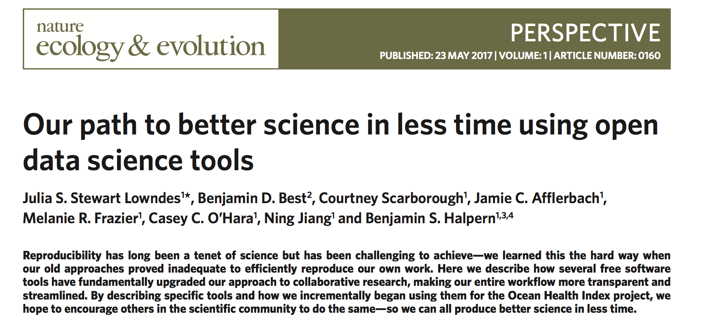

 

 

We are marine scientists who now do better science in less time.  

We learned the hard way that we needed to transform how we worked to efficiently reproduce and build off our own work.  

We're sharing [our story](/our_story) and how we use open and reproducible practices for the Ocean Health Index. By providing concrete examples of how we work and [how we learned](/resources_and_community), we hope to encourage others to do the same.

 
 

