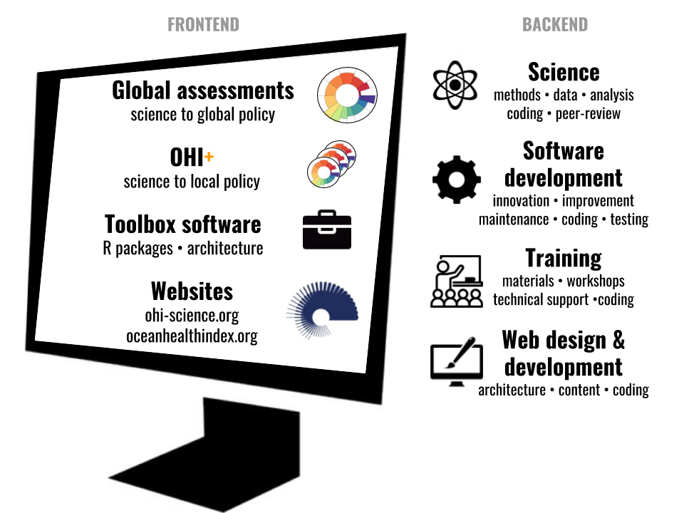

<!---From http://stackoverflow.com/questions/31753897/2-column-section-in-r-markdown:
Put in your css file or directly in rmarkdown--->

 

### Our story

Over the past four years we have dramatically improved how we do science by embracing open data science practices and tools. We now emphasize communication and work in ways that are more reproducible, streamlined, transparent, collaborative, and open.  

We're sharing our story because although the transformation to open data science seemed intimidating, we are living proof that it's possible and we want to encourage others to adopt these practices in their own work.  

**Here are ways to learn more about our story:** 

- [**Our path to better science in less time using open data science tools**](https://www.nature.com/articles/s41559-017-0160) (Lowndes *et al.* 2017, *Nature Ecology and Evolution*)
    - [Manuscript on GitHub](https://github.com/OHI-Science/betterscienceinlesstime/tree/gh-pages/manuscript) and [blog on ohi-science.org](http://ohi-science.org/news/better-science-faster) 
         
- [TechBlog: My digital toolbox: Julia Stewart Lowndes](http://blogs.nature.com/naturejobs/2017/05/23/techblog-julia-stewart-lowndes/) (Perkel 2017, *Nature*)
- [Better Science Faster](http://www.news.ucsb.edu/2017/017990/better-science-faster) (Cohen 2017, *UCSB Current*)
- [Scientists transform how complex marine data from the Ocean Health Index is synthesized, communicated](https://phys.org/news/2017-05-scientists-complex-marine-ocean-health.html) (Cohen 2017, *Phys.org*)
- [Transforming how complex marine data is synthesized](https://www.sciencedaily.com/releases/2017/05/170523144113.htm) (University of California - Santa Barbara 2017, *ScienceDaily*)
- [The Common Language of Conservation](http://www.lastwordonnothing.com/2017/05/24/the-common-language-of-conservation/) (Nijhuis 2017, *The Last Word On Nothing*)
- [Awash in Sea of Data, Ecologists Turn to Open Access Tools](https://www.quantamagazine.org/awash-in-sea-of-data-ecologists-turn-to-open-access-tools-20170524/) (Rennie 2017, *Quanta Magazine*)
- [Ecologists Are Drowning in Sea of Data. These Tools Could Help](https://www.wired.com/2017/05/ecologists-drowning-sea-data-open-access-tools-help) (Rennie 2017, *WIRED*)

<!---
https://www.openchannels.org/news/news/julia-stewart-lowndes-interview-ocean-health-index-and-improving-science-management?utm_source=OpenChannels+Community+Members&utm_campaign=91c04dadaf-Weekly_Update_05_26_2017&utm_medium=email&utm_term=0_96f5655e1e-91c04dadaf-107336605

http://www.unep.org/nairobiconvention/marine-and-coastal-news-round-western-indian-ocean-region-26-may-2017
--->

 
 

### More science, less time

 

 
 

With the [Ocean Health Index](http://ohi-science.org), we've been measuring and tracking the health of [global oceans every year since 2012](http://ohi-science.org/ohi-global/). By becoming more efficient and reproducible, we've greatly reduced the time involved to repeat our work, which lets us focus more on science.  

And since it's all open online, anyone can build directly off our work without reinventing the wheel. Currently there are [20 groups around the world](http://ohi-science.org/projects/ohi-assessments/) building off our science and our code to assess ocean health in their own jurisdictions. 

 
**Citation:**  
Lowndes JSS, Best BD, Scarborough C, Afflerbach JC, Frazier MR, O'Hara CC, Jiang N, Halpern BS (2017). Our path to better science in less time using open data science tools. *Nature Ecology & Evolution*, 1 Article number: 0160. [doi:10.1038/s41559-017-0160](https://www.nature.com/articles/s41559-017-0160)  

 

### The Ocean Health Index

The Ocean Health Index (OHI) is a scientific framework to quantify and track the health of our oceans. We are an academic-nonprofit partnership from the [National Center for Ecological Analysis and Synthesis (NCEAS)](https://www.nceas.ucsb.edu/) and [Conservation International](http://www.conservation.org/Pages/default.aspx).   

Open data science tools enable us to work efficiently and emphasize communication for science and management. Learn more at our overview website [oceanhealthindex.org](www.oceanhealthindex.org) and our science website [ohi-science.org](http://ohi-science.org).

 

<!---- 
- Press
- Blog
--->

